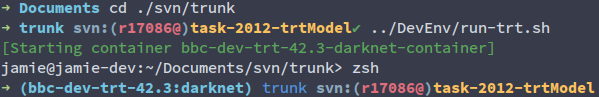

# zsh-docker-svn-prompt
## Docker env hint
If you are in a docker container, and the env var (__MYNAME__) has been set, then the prefix (__($MYNAME)__) will be added to the prompt, otherwise the prefix would be __(docker)__ .

## svn info 
You need to enable the svn plugin in _.zshrc_ first. The display is similar to the git prompt.

## Examples
